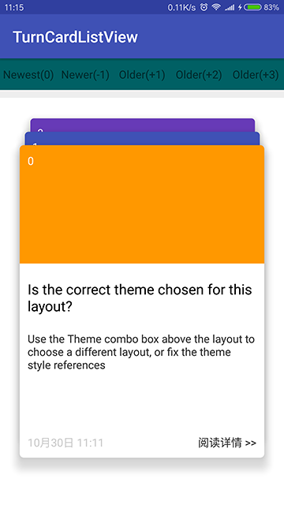
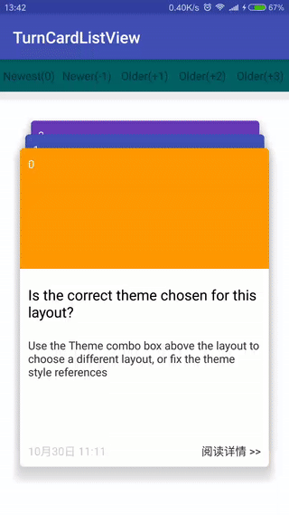

# TurnCardListView
 
[](https://jitpack.io/#czy1121/turncardlistview)
 
上下翻页的卡片列表(类似荷包的的消息列表)  

 



## Gradle

``` groovy
repositories { 
    maven { url "https://jitpack.io" }
}
```  
    
``` groovy
dependencies {
    compile 'com.github.czy1121:turncardlistview:1.0.0'
}
```
    
## Usage
    
**XML**

``` xml 
<com.github.czy1121.view.TurnCardListView
    android:id="@+id/card_list"
    android:layout_width="match_parent"
    android:layout_height="match_parent" />
``` 

**Java**

``` 

TurnCardListView list = (TurnCardListView) findViewById(R.id.card_list);

list.setOnTurnListener(new TurnCardListView.OnTurnListener() {
    @Override
    public void onTurned(int position) { 
        Toast.makeText(MainActivity.this, "position = " + position, Toast.LENGTH_SHORT).show();
    }
});


list.setAdapter(new BaseAdapter() {
    int[] colors = {0xffFF9800, 0xff3F51B5, 0xff673AB7, 0xff006064, 0xffC51162, 0xffFFEB3B, 0xff795548, 0xff9E9E9E};

    @Override
    public int getCount() {
        return colors.length;
    }

    @Override
    public Object getItem(int position) {
        return position;
    }

    @Override
    public long getItemId(int position) {
        return position;
    }

    @Override
    public View getView(int position, View child, ViewGroup parent) {
        if (child == null) {
            child = LayoutInflater.from(parent.getContext()).inflate(R.layout.item_message, parent, false);
        }

        ((TextView)child.findViewById(R.id.pos)).setText("" + position);
        child.findViewById(R.id.image).setBackgroundColor(colors[position]);
        return child;
    }
});
```
  

## License

```
Copyright 2016 czy1121

Licensed under the Apache License, Version 2.0 (the "License");
you may not use this file except in compliance with the License.
You may obtain a copy of the License at

   http://www.apache.org/licenses/LICENSE-2.0

Unless required by applicable law or agreed to in writing, software
distributed under the License is distributed on an "AS IS" BASIS,
WITHOUT WARRANTIES OR CONDITIONS OF ANY KIND, either express or implied.
See the License for the specific language governing permissions and
limitations under the License.
```